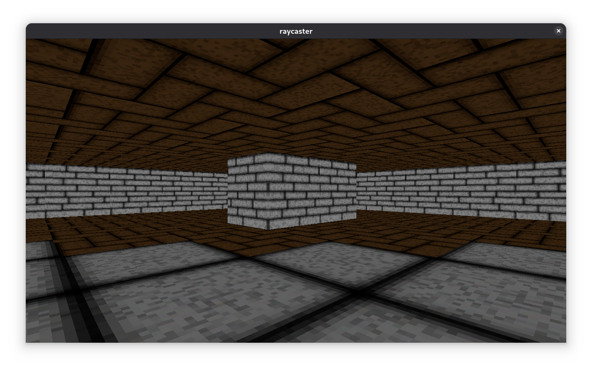

# OpenMP-Raycaster

Este programa é um programa que utiliza a técnica de *Raycasting* para
renderizar por software, uma cena 3d simples. Além disso, ele também utiliza o
*OpenMP* para paralelizar o processo, permitindo que haja otimizações.

Este programa está distribuído sob a licença GNU GPLv3+.



# Compilação e execução

São necessárias as seguintes dependências:
- SDL2
- SDL2\_image
- cmake
- g++
- openmp
- git

Clone este repositório no seu computador e acesse sua pasta. Depois disso,
digite no seu terminal:

```
$ cmake -B build
$ cd build && make
$ cd ..
$ ./build/raycaster
```

O programa irá rodar adequadamente. O programa necessita do arquivo de imagens
para rodar, que aqui é chamado de *textures.png*.

# Controles

O programa os seguintes controles:

```
W - andar para frente
S - andar para trás
A - andar para esquerda
D - andar para direita
J - mirar para a esquerda
K - mirar para a direita
mouse - movimentar a câmera
```

# Multithreading e teste de performance

Caso você queira testar a performance, você pode executar o programa
utilizando variáveis de ambiente. Por exemplo, para executar com
uma thread, você pode:

```
OMP_NUM_THREADS=1 ./build/raycaster
```

O programa imprime um resumo da performance, o tempo que demorou
para executar, o número de quadros, e o número médio de quadros
por segundo.

Por exemplo, executando o programa com 4 threads no meu computador,
este é o resultado:
```
Program time: 6.916000
Total frames: 1955
Average FPS: 282.677856
```

Executando com apenas uma thread, o resultado é:
```
Program time: 6.921000
Total frames: 699
Average FPS: 100.9969
```

Ou seja, um speedup de quase 3 vezes, o que é bastante, considerando
que é um renderizador por software rodando em HD.
